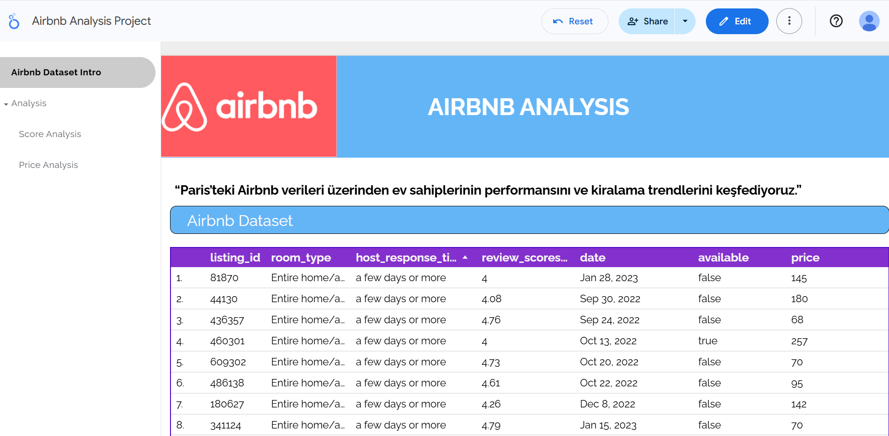
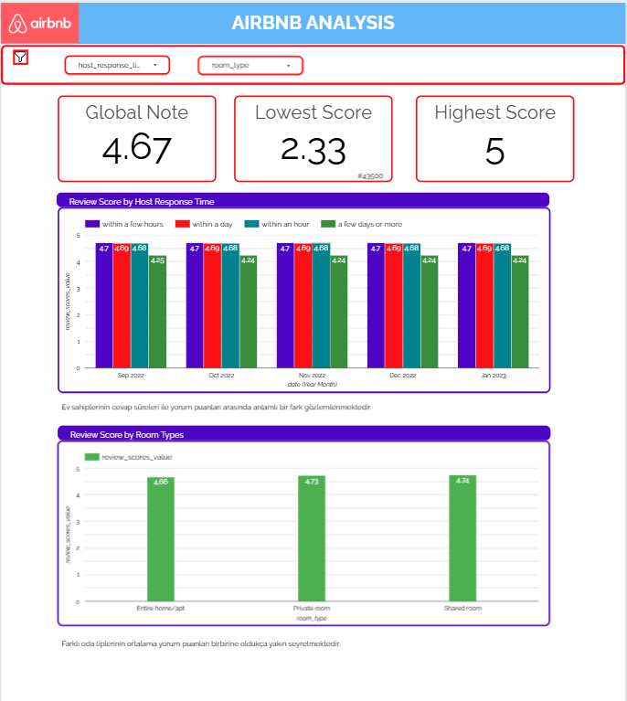
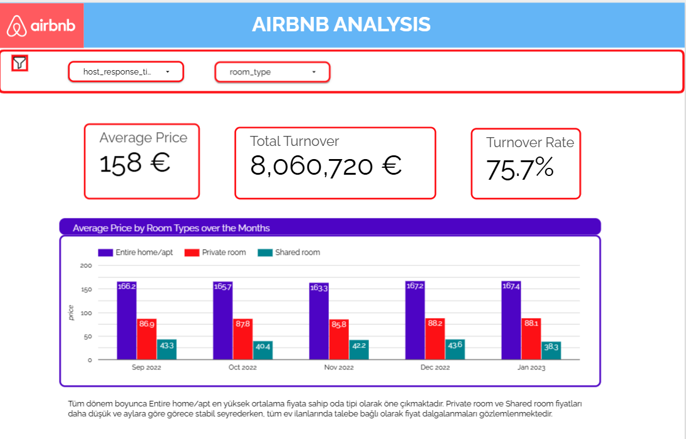
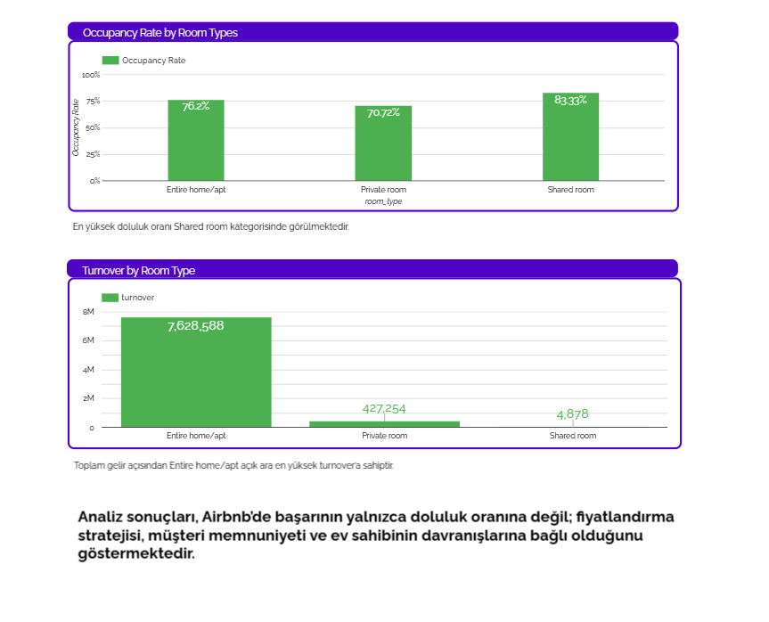

# 📊 Airbnb Data Analysis - Looker Studio Dashboard

## 🔍 Project Overview
Paris’teki Airbnb verileri üzerinden ev sahiplerinin performansını ve kiralama trendlerini keşfediyoruz.  
Bu proje, veri görselleştirme ve analiz tekniklerini kullanarak önemli KPI’ları ve trendleri ortaya koymaktadır.

## 🔗 Live Dashboard
👉 [Looker Studio Dashboard’u Görüntüle](https://lookerstudio.google.com/reporting/36f9a670-7f77-43a1-8674-34ba0d836c7b/page/p_l33eefpp0c)

## 📌 Used Tools
- Looker Studio
- Google Sheets / CSV / BigQuery
- Data Visualization
- KPI Analysis

## 📈 Dashboard Preview
### Overview

### Page 1

### Page 2

### Page 2.2

## 🎯 Key Insights
- Paris’teki Airbnb ev sahiplerinin performans farkları gözlemlendi  
- Müşteri tercihleri ve memnuniyet faktörleri analiz edildi
- Veri odaklı karar alma süreçleri için görsel destek sağlandı
